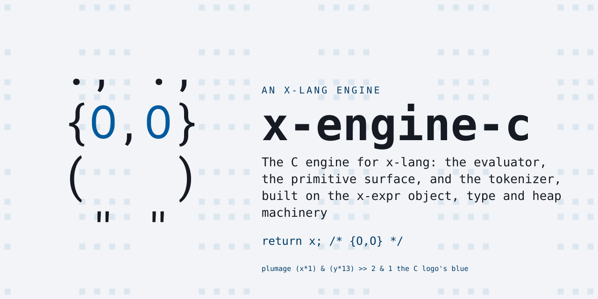
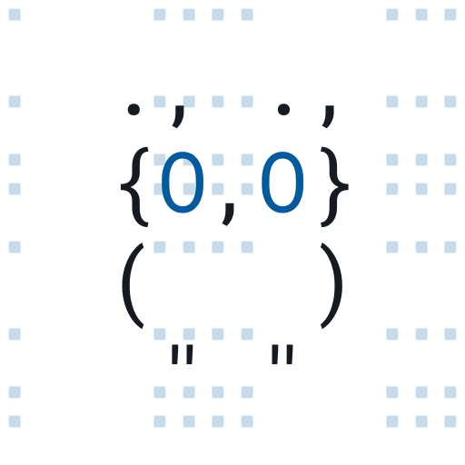

# x-engine-c

The C engine for [x-lang][x-lang]: the evaluator, the primitive surface, and
the tokenizer, built on the [x-expr][x-expr] object, type and heap machinery.

This repository builds one artifact — `x-bin` — and `x-bin` cannot do anything
on its own. It has no printer, no REPL, no standard library; those are written
*in x-lang* and live in the [x-lang][x-lang] repository. The engine reads a
program from stdin and evaluates it, and the wrapper there is what pipes the
library in front of your source:

    { cat lib/x-core.x; cat program.x; } | ./x-bin

That is the whole coupling. The engine embeds no x-lang text and generates
none; it binds exactly one string, `x-release`, so a booted image can say which
release it was built for.

## Build

    git clone --recursive https://github.com/jonruttan/x-engine-c.git
    cd x-engine-c
    make

`--recursive` matters: [x-expr][x-expr] is a submodule and the build needs its
sources. C89 (`-ansi`), no dependencies beyond libc and `-ldl` (the FFI and JIT
layers use `dlopen`/`dlsym`).

    make            # build + strip
    make test       # the contract gates + both spec suites
    make gates      # the three contract gates alone
    make test-c     # the C spec suite alone
    make test-bare  # the bare-engine smoke specs (no library)
    make test-asan  # the C suite under AddressSanitizer
    make help       # every target

Variant builds — `x-bin-debug`, `x-bin-profile`, `x-bin-asan`, `x-bin-cov` —
each compile to their own object suffix, so no two configurations share an
object path and variants rebuild incrementally.

## Layout

| path | what |
|---|---|
| `src/x-eval.c` | the evaluator |
| `src/x-prim/` | the primitive surface (arith, string, io, ffi, heap, …) |
| `src/x-syntax/` | the special forms (binding, closure, control, quote) |
| `src/x-token/` | the s-expression reader |
| `src/x-type/` | the type implementations |
| `src/x-obj/` | object and JIT support |
| `src/x-cli.c` | the command-line entry point |
| `opt/x-prim/signal.c` | optional SIGINT handling (`make X_SIGNAL=` omits it) |
| `include/` | headers, including the generated `x-eval-layout.h` |
| `ext/x-expr/` | the foundation library, as a submodule |
| `tests/c/` | the C spec suite |
| `tests/bare/` | bare-engine smoke specs — the engine with no library on stdin |
| `tools/contract/` | the committed manifests, shipped as the engine's self-description |

## Testing the engine unaided

Every other runner in the project cats a library onto stdin ahead of the test,
so what it measures is the library's surface. For a primitive that is the wrong
subject: reached through `prim-ref`, through a class, or through any name the
library rebinds, it is not the primitive under test. `+` is the plain case — the
primitive is *binary*, and the variadic `+` every ordinary spec exercises is
`lib/x/core/arithmetic.x` sitting on top of it.

`make test-bare` loads nothing. Each case is one engine process fed two lines:
the allocation guard, then the source.

This is **not** the cross-engine conformance suite. That defines what *any*
evaluator must do, so it belongs with the language and lives in
[x-lang][x-lang]; an implementation that owned it would become the arbiter of
the contract every other implementation is judged against.

## The contracts

Four ratchets pin this C surface so it cannot grow or shift silently. Three
live here and are fully self-contained — each scans this repo's C and diffs it
against a committed manifest, with no x-lang checkout anywhere in the loop:

| gate | pins | against |
|---|---|---|
| `make check-isa` | every binding site in the C | `tools/contract/isa.x` |
| `make check-obj-layout` | the object header layout | `tools/contract/obj-layout.x` |
| `make check-base-paths` | the base-field accessor chains | `tools/contract/base-paths.x` |

Those manifests are also **the engine's published description of itself**.
x-lang's boot loads `base-paths.x` and `obj-layout.x` to learn this engine's
field offsets, and its `pin.x` reads `isa.x` to answer which C surface a tree
carries. They ship with the engine rather than being copied into the library,
so a library can never run on an engine whose layout disagrees with the copy
it holds — which is exactly the failure the release-identity work was about.

Each of the three has a **runtime half** — a spec that probes a live engine —
and those need a library to boot, so they run in x-lang under
`tests/x/specs/meta/`.

The fourth ratchet, `check-prim-coverage`, asks whether every primitive is
*exercised* by a spec. Most primitives are reachable only through the library,
so the honest answer needs both spec suites at once; it runs in x-lang, over
this repo's sources and both suites.

`tools/contract/base-layout.x` is a pure build input: `make gen-layout` turns
it into `include/x-eval-layout.h`. That header is committed, so a plain
checkout builds without awk. Edit the descriptor, regenerate, then
`make clean && make` — header changes do not trigger object rebuilds on their
own here.

## Adding a primitive

Growing the C surface takes a deliberate manifest edit in the same commit —
that is the point of the ratchet. Register the primitive, run `make check-isa`,
and add the line it reports to `tools/contract/isa.x`. CI here refuses the
commit that skips it.

Then give it a spec: in `tests/c/` if it is reachable from C, or in x-lang's
suite if it is only reachable through the library. `make check-prim-coverage`
in x-lang will fail until one of those exists, or until the primitive carries
a written reason for being deliberately unspecced.

## Documentation

`make doc-c` generates the Doxygen C reference into `docs/ref/c/` (needs
Doxygen). `make install-man` installs its section-3 man pages.

## Licence

MIT No Attribution (MIT-0). See [LICENSE](LICENSE).

[x-lang]: https://github.com/jonruttan/x-lang
[x-expr]: https://github.com/jonruttan/x-expr

